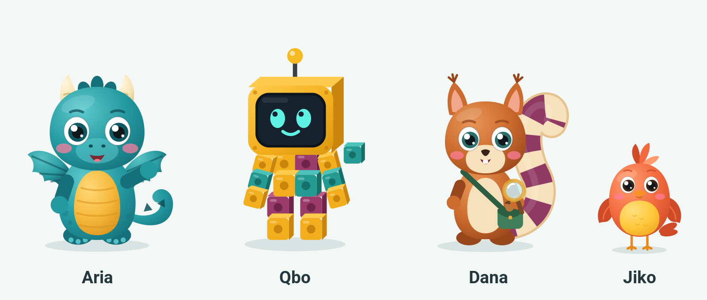

# کتاب شخصیت شمارا · نسخهٔ ۲

شناسه‌های داده `aria / qbo / dana / jiko` بدون تغییرند؛ فقط ظاهر، گونه و assetKey عوض شده است.
مرجع بصری: `concepts/` (کانسپت آرت) · مرجع تولید: `assets/characters/` (SVG لایه‌ای) · منبع واحد: `source/shomara-cast.mjs`.

## ۱. چرا cast قبلی حذف شد
1. **یک بدن، چهار سر:** همان شکم بیضی نعنایی، همان دو پا، همان یک دست؛ فقط سر عوض می‌شد.
2. **تست silhouette رد:** چهار شخصیت سیاه‌شده از هم تشخیص داده نمی‌شدند.
3. **گونه نامشخص و متناقض با کد:** آریا شبیه گربه با بال خفاش؛ جیکو در کد پرنده («جیک‌جیک») ولی در طرح روباه؛ دانا در کد سنجاب ولی در طرح جغد.
4. **Baby schema ضعیف:** چشم ریز، نقطه‌ای و بالای صورت (Glocker 2009؛ Borgi 2014، کودکان ۳ تا ۶ سال).
5. **ژست مرده** و **نقش ریاضی بیرون از بدن**.

## ۲. درس‌های پلتفرم‌های مشابه
Duolingo: شکل ساده، silhouette اول، پای جدا، Rive. · Khan Academy Kids: پنج گونهٔ کاملاً متفاوت، یک main، تحسین «کاری که کودک کرد». · Lingokids: ربات ساخته‌شده از اسباب‌بازی. · Numberblocks / DragonBox: مفهوم ریاضی در بدن شخصیت.

## ۳. اصول قفل‌شده
- silhouette منحصربه‌فرد: گلابی + بال (آریا) · مستطیل مکعبی (کیوبو) · S بزرگ دم (دانا) · توپ با کاکل (جیکو)
- زبان شکل: گرد = امن، مربع = منطقی، S = کنجکاو؛ بدون مثلث تیز
- سر ۵۰ تا ۵۵٪ قد، چشم درشت پایین‌تر از وسط سر با دو برق، گونهٔ صورتی
- قد نسبی: کیوبو ۱٫۱ · آریا ۱٫۰ · دانا ۰٫۹۵ · جیکو ۰٫۶۲
- ریاضی در بدن: مکعب‌های کیوبو (تجزیه)، دم AB دانا (الگو)
- بدون دندان تیز، چنگال، آتش یا ابروی عصبانی؛ بدون لرزش یا «نه» گفتن با سر
- **استثنای ثبت‌شده (P01):** دو دندان جلویی **گرد و کُند** دانا نشانهٔ گونهٔ سنجاب است و مجاز است؛ هرگز تیز نمی‌شود (`toothPolicy` در `characters-v2.json`).
- **استثنای ثبت‌شده (P01):** کیوبو در حالت think چشم ندارد؛ صفحه‌اش حلقهٔ loading نشان می‌دهد (`requiredIdExceptions`).

## ۴. cast
| | آریا `aria-dragon-v2` | کیوبو `qbo-cubes-v2` | دانا `dana-squirrel-v2` | جیکو `jiko-bird-v2` |
|---|---|---|---|---|
| گونه | بچه‌اژدها | ربات از مکعب شمارش | سنجاب | پرندهٔ آوازخوان |
| نقش | راهنمای اصلی | شمردن، دسته‌بندی، تجزیه | الگو، شکل، فضا، تقارن | جشن، جایزه، milestone |
| رنگ اصلی | `#239AA0` + شکم `#F6B93B` | `#F2AE1C` + `#239A92` + `#9A3B69` | `#CB6B2E` + دم کرم/`#8F3963` | `#F26A3E` + سینه `#FFC93C` |
| عادت | از ذوق جرقهٔ ستاره‌ای عطسه می‌کند | یک مکعبش همیشه کج است | وقتی الگو پیدا شود دمش پف می‌کند | آهنگ سه‌نتی؛ روی سر آریا می‌نشیند |
| تکیه‌کلام | قدم‌به‌قدم با هم! | بیا یکی‌یکی بسازیمش! | چی دوباره تکرار می‌شه؟ | جیک‌جیک! جشن بگیریم! |

روابط: آریا و جیکو دوستان صمیمی‌اند؛ کیوبو را آریا و دانا از مکعب‌های قدیمی ساخته‌اند؛ دانا عاشق نظم و کیوبو عاشق ساختن است.

## ۵. حالت‌ها و رویدادها (قرارداد بدون تغییر)
| رویداد | حالت | رفتار |
|---|---|---|
| SESSION_START | idle | آرام؛ در درس بدون حلقه |
| EXPLAIN / HINT_OPENED | think | نگاه بالا، دست زیر چانه / ذره‌بین / صفحهٔ loading |
| ANSWER_WRONG | encourage | یک ژست دست باز، بدون لرزش |
| ANSWER_CORRECT | correct | یک تکان آرام سر |
| RECOVERY | recovery | تاب آهسته، لبخند گرم |
| STATION_PASS / MILESTONE / REWARD_GRANTED | celebrate | سه پرش، حداکثر ۲ ثانیه |

در سنجش (Check A/B، mastery) هیچ شخصیتی رندر نمی‌شود.

## ۶. اندازه و جایگذاری
درس: حداکثر ۹۶dp، بیرون از ناحیهٔ شمارش، یک گوینده. زیر ۷۲dp فقط نیم‌تنه (`bust.svg`). خانه/معرفی: ۱۲۸ تا ۱۸۰dp.

## ۷. وضعیت واقعی
آماده: ۲۴ SVG حالت + ۴ نیم‌تنه، lineup، آیکون، انیمیشن لایه‌ای وب، انیمیشن اسپرایت موبایل، PNG چگالی ۱x/۲x/۳x، preview تعاملی، QA ساختاری.
آماده نیست: فایل `.riv` (نیازمند Rive Editor، بریف در `RIVE-RIG-BRIEF.md`)، نمای سه‌رخ/بغل برداری (فقط در کانسپت)، صدا، تست با کودک، build روی گوشی.
